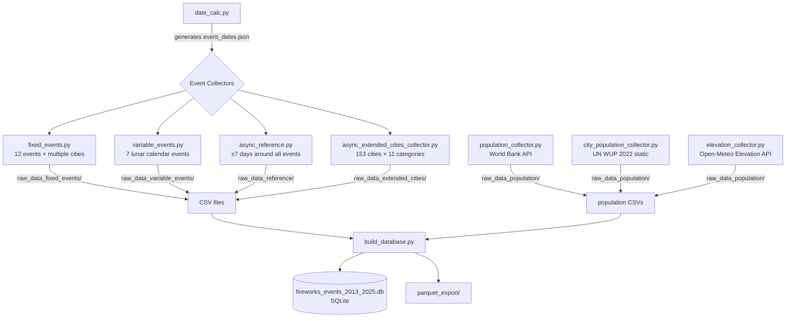

# 🎆 Fireworks Environmental Impact — Global Data Collection Project

A comprehensive data collection and analysis pipeline investigating the environmental impact of fireworks events worldwide. The project collects historical weather, air quality, and soil data for New Year's Eve and other major fireworks events across 155+ countries and hundreds of cities for the years 2013–2025.

---

## Table of Contents

1. [Project Overview](#1-project-overview)
2. [Scientific Background & Motivation](#2-scientific-background--motivation)
3. [Data Sources](#3-data-sources)
4. [Project Evolution & Key Decisions](#4-project-evolution--key-decisions)
5. [Data Collection Pipeline](#5-data-collection-pipeline)
6. [File Structure](#6-file-structure)
7. [Database Schema](#7-database-schema)
8. [Fireworks Events Covered](#8-fireworks-events-covered)
9. [Variables Collected](#9-variables-collected)
10. [Known Limitations](#10-known-limitations)
11. [Running the Scripts](#11-running-the-scripts)
12. [Dependencies](#12-dependencies)

---

## 1. Project Overview

This project collects multi-source environmental data to investigate whether fireworks events have a measurable impact on air quality, weather patterns, and soil conditions. Rather than attempting to *confirm* a negative impact, the scientific goal is formulated as:

> **"Investigate whether major fireworks events show measurable and consistent effects on atmospheric conditions, particularly particulate matter (PM2.5 and PM10), across different geographic and cultural contexts."**

The dataset covers:
- **155 countries** via their capital cities (New Year's Eve baseline)
- **Hundreds of additional cities** for event-specific and geographic coverage
- **13 years** of data (2013–2025)
- **Multiple event types** beyond New Year's Eve
- **Reference days** (±7 days around each event) for baseline comparison

---

## 2. Scientific Background & Motivation

### Why fireworks?
Fireworks release significant amounts of particulate matter (PM2.5, PM10), heavy metals, nitrogen oxides, and other pollutants into the lower atmosphere. Their impact is concentrated in very short time windows, making them an ideal subject for causal analysis.

### Why model data?
All data in this project is **reanalysis model data**, not direct station measurements:

| Source | Model | Resolution |
|--------|-------|------------|
| Open-Meteo ERA5 | ECMWF ERA5 reanalysis | ~31 km |
| Open-Meteo CAMS | Copernicus CAMS air quality | ~40–80 km |
| NASA POWER | MERRA-2 reanalysis | ~50 km |

This means each coordinate is mapped to the nearest **model grid point**, not the nearest weather station. The advantage is complete global coverage with no missing countries; the disadvantage is lower spatial resolution than station data.

> **Important methodological note:** Results from model data should be interpreted carefully. Absolute values may differ from ground truth measurements, but relative patterns (event night vs. reference night, country comparisons) remain scientifically meaningful.

### Why reference days?
Without baseline comparison values, elevated PM2.5 on New Year's Eve could simply reflect typical winter air quality for that region. By collecting data from 7 days before and after each event (same weekday, same season), the dataset enables direct before/after comparison.

---

## 3. Data Sources

### Open-Meteo ERA5 (Weather)
- **URL:** `https://archive-api.open-meteo.com/v1/era5`
- **Coverage:** Global, 1940–present
- **Rate limit:** ~10,000 requests/day (free tier)
- **No API key required**

### Open-Meteo CAMS (Air Quality)
- **URL:** `https://air-quality-api.open-meteo.com/v1/air-quality`
- **Coverage:** Global, **2013–present** (important: data before 2013 is unavailable)
- **Rate limit:** Shared with ERA5
- **No API key required**

### NASA POWER MERRA-2 (Soil)
- **URL:** `https://power.larc.nasa.gov/api/temporal/hourly/point`
- **Coverage:** Global, 1981–present
- **Rate limit:** Stricter than Open-Meteo — 5-second delays used
- **No API key required**

### World Bank API (Population)
- **URL:** `https://api.worldbank.org/v2/country`
- **Coverage:** Global, annual
- **No API key required**

### Open-Meteo Elevation API
- **URL:** `https://api.open-meteo.com/v1/elevation`
- **Source:** Copernicus DEM GLO-90 (90m resolution)
- **Used for:** Static elevation data for all locations

---

## 4. Project Evolution & Key Decisions

This section documents the key decisions made during development, including errors encountered and how they were resolved.

### 4.1 Initial Design — Single Script, JSON Output
The project started with a single Python script collecting weather and air quality data and saving results as JSON files. After reviewing the structure, **CSV was chosen over JSON** for several reasons:
- Easier to inspect and validate individual country files
- Direct compatibility with pandas for database import
- Append mode allows resuming interrupted runs without data loss

### 4.2 Rate Limiting — No Ban Risk
An initial concern was whether collecting data for all 155 countries would trigger API rate limits. The calculation:

```
155 countries × 13 years × 2 API calls (weather + air) = ~4,030 requests
With 4-second delays ≈ 4,500 seconds ≈ 75 minutes
Open-Meteo limit: ~10,000 requests/day
```

**Conclusion:** All countries can be run in a single uninterrupted session. The checkpoint system ensures safe resumption if interrupted.

### 4.3 Year Range Correction — 2013 not 2011
The initial year range was `2011–2025`. During the first run, a `400 Bad Request` error revealed that **CAMS air quality data is only available from 2013 onwards**. The year range was corrected to `2013–2025` for all scripts.

```
ERROR: 400 Bad Request
URL: ...start_date=2011-12-31...
REASON: CAMS data unavailable before 2013
FIX: years = range(2013, 2026)
```

### 4.4 Bug Fix — Safe Column Access
A subtle bug was found in the `write_rows` function where missing columns would cause incorrect index access:

```python
# BUGGY:
row[f"w_{col}"] = weather["hourly"].get(col, [None] * (idx+1))[idx]

# FIXED:
vals = weather["hourly"].get(col)
row[f"w_{col}"] = vals[idx] if vals else None
```

### 4.5 Soil Data — NASA POWER Integration
Initially, soil parameters (`soil_temperature_0cm`, `soil_moisture_0_1cm`) were included in the Open-Meteo ERA5 request. Analysis revealed these fields were **100% empty** across all countries — ERA5 does not provide these via the standard hourly endpoint.

**Solution:** Soil data collection was integrated directly into all event collector scripts using the **NASA POWER MERRA-2** API, which provides reliable global soil data:
- `GWETTOP` → surface soil moisture (0–10 cm)
- `GWETROOT` → root zone soil moisture
- `GWETPROF` → full profile soil moisture
- `TSOIL1` → soil temperature layer 1

**Why soil data matters for the analysis:**
Dry, warm soil conditions can increase background PM10 levels through dust resuspension, potentially confounding the fireworks signal. Soil moisture is therefore an important control variable when isolating the fireworks signal from background variation.

### 4.6 Data Quality Findings
Analysis of sample CSVs (Afghanistan, Albania, China, Germany) revealed important data quality patterns:

| Variable Group | Germany | China | Afghanistan |
|---------------|---------|-------|-------------|
| Weather (ERA5) | ✅ Complete | ✅ Complete | ✅ Complete |
| PM2.5, PM10, NO₂ | ✅ Complete | ✅ Complete | ❌ Empty |
| Carbon monoxide | ✅ Complete | ✅ Complete | ✅ Complete |
| aerosol_optical_depth | ⚠️ ~69% empty | ⚠️ ~69% empty | ❌ Empty |
| Soil data (MERRA-2) | ✅ Complete | ✅ Complete | ✅ Complete |

**Key finding:** CAMS air quality data is sparse for remote or sparsely populated countries. For robust air quality analysis, restrict to 2016–2025 and focus on regions with good CAMS coverage.

### 4.7 Expanding Beyond New Year's Eve
The initial scope was New Year's Eve only. The project was expanded to include all major global fireworks events, recognizing that:
- Chinese New Year produces larger fireworks events than Western New Year in East Asia
- Diwali is the largest fireworks event in South Asia
- Comparing events across cultural contexts strengthens causal inference

This required:
- `date_calc.py` for variable-date events (lunar calendar)
- Separate `fixed_events.py` and `variable_events.py`
- Event-specific time windows (fireworks don't always happen at midnight)
- `async_reference.py` for ±7-day comparison data

### 4.8 Event-Specific Time Windows
Different fireworks events occur at different hours. Using a single time window for all events would include irrelevant hours or miss the actual event:

| Event | Time Window | Reason |
|-------|------------|--------|
| New Year's Eve | 22:00–02:00 | Midnight countdown |
| Independence Day (USA) | 20:00–23:00 | Dusk shows |
| Bonfire Night (UK) | 18:00–22:00 | Early November darkness |
| Las Fallas | 12:00–15:00 + 21:00–23:00 | Mascletà at 14:00 + evening |
| Diwali | 17:00–23:00 | Full evening celebrations |
| Loy Krathong | 17:00–23:00 | Lanterns all evening |

### 4.9 Actual Runtime vs. Estimate
The main silvester script (155 countries, 2013–2025) ran for **3 hours 37 minutes** — slightly under the 4-hour estimate, indicating good API response times from Open-Meteo.

Progress tracking during the run:
```
 27 min → Brazil  (letters A–B complete)
 90 min → Iceland (letters A–I almost complete)
144 min → Nigeria (letters A–N complete)
181 min → Spain   (letters A–S complete)
204 min → UAE     (almost done)
217 min 14 sec → Zimbabwe (complete)
```

### 4.10 Fireworks Regulations as Control Variable
A fireworks regulation table (2013–2025) was compiled to enable regulatory comparison. Countries are classified as:
- **Complete ban** for private use: Ireland, Chile, Australia
- **Strict restrictions**: Sweden (rockets banned 2014), Netherlands (major tightening 2015, F3 banned 2020)
- **Moderate regulation**: Germany, France, UK, Belgium
- **Largely unregulated**: Brazil, Russia, Mexico, most of Africa/Middle East

This allows comparison of PM2.5 trends in countries that introduced bans vs. those that did not.

---

## 5. Data Collection Pipeline



## 6. File Structure

```mermaid
graph TD
    ROOT[Project Root]

    ROOT --> SCRIPTS[Scripts]
    ROOT --> RAW[Raw Data Folders]
    ROOT --> DB[Database]
    ROOT --> DOCS[Documentation]

    SCRIPTS --> S1[date_calc.py]
    SCRIPTS --> S4[fixed_events.py]
    SCRIPTS --> S5[variable_events.py]
    SCRIPTS --> S6[async_reference.py]
    SCRIPTS --> S7[async_extended_cities_collector.py]
    SCRIPTS --> S8[population_collector.py]
    SCRIPTS --> S9[city_population_collector.py]
    SCRIPTS --> S10[elevation_collector.py]
    SCRIPTS --> S11[build_database.py]
    SCRIPTS --> S12[patch_atlanta.py]
    SCRIPTS --> S13[patch_missing_reference_days.py]

    RAW --> R3[raw_data_fixed_events/\n12 event CSVs]
    RAW --> R4[raw_data_variable_events/\n7 event CSVs]
    RAW --> R5[raw_data_reference/\n19 event CSVs\n±7 day reference data]
    RAW --> R6[raw_data_extended_cities/\nCategory CSVs\n153 cities]
    RAW --> R7[raw_data_population/\ncountry_population_2013_2025.csv\ncity_population_2013_2025.csv\nelevation_all_locations.csv]

    DB --> DB1[fireworks_events_2013_2025.db]
    DB --> DB2[parquet_export/\n9 Parquet files]
    DB --> DB3[event_dates.json\nauto-generated by date_calc.py]

    DOCS --> D1[README.md]
```


## 7. Database Schema

The final SQLite database `fireworks_events_2013_2025.db` contains 7 tables:
```mermaid
erDiagram
    silvester_airquality_weather_2013_2025 {
        string country
        string city
        float latitude
        float longitude
        string time
        int year
        float w_temperature_2m
        float w_wind_speed_10m
        float w_boundary_layer_height
        float a_pm2_5
        float a_pm10
        float a_nitrogen_dioxide
        string "...21 weather cols"
        string "...9 air quality cols"
    }

    silvester_soil_2013_2025 {
        string country
        string city
        float latitude
        float longitude
        string time
        int year
        float s_soil_moisture_top
        float s_soil_moisture_root
        float s_soil_moisture_profile
        float s_soil_temperature_1
    }

    fixed_events_2013_2025 {
        string event
        string country
        string city
        float latitude
        float longitude
        string time
        int year
        int is_event_day
        string "...weather cols"
        string "...air quality cols"
        string "...soil cols"
    }

    variable_events_2013_2025 {
        string event
        string country
        string city
        float latitude
        float longitude
        string time
        int year
        int is_event_day
        string "...weather cols"
        string "...air quality cols"
        string "...soil cols"
    }

    reference_days_2013_2025 {
        string event
        string reference_type
        string country
        string city
        float latitude
        float longitude
        string time
        int year
        int days_offset_from_event
        string "...weather cols"
        string "...air quality cols"
        string "...soil cols"
    }

    country_population_2013_2025 {
        string country
        string iso3
        int year
        float population_total
        float population_density_per_km2
        float urban_population_pct
    }

    city_population_2013_2025 {
        string city
        string country
        float latitude
        float longitude
        int year
        int population_estimate
        string source
    }

    elevation_all_locations {
        string location_type
        string name
        string country
        float latitude
        float longitude
        float elevation_m
    }
```

### Key JOIN patterns
```sql
-- Join Silvester weather/air with soil data
SELECT w.*, s.s_soil_moisture_top, s.s_soil_temperature_1
FROM silvester_airquality_weather_2013_2025 w
JOIN silvester_soil_2013_2025 s
    ON w.country = s.country AND w.time = s.time;

-- Compare event night vs reference nights
SELECT e.city, e.a_pm2_5 as pm25_event,
       r.a_pm2_5 as pm25_reference,
       e.a_pm2_5 - r.a_pm2_5 as pm25_delta
FROM fixed_events_2013_2025 e
JOIN reference_days_2013_2025 r
    ON e.city = r.city
    AND e.year = r.year
    AND e.event = r.event
WHERE e.event = 'diwali'
    AND e.is_event_day = 1
    AND r.reference_type = 'minus_7';

-- Add population context
SELECT w.country, w.a_pm2_5, p.population_density_per_km2
FROM silvester_airquality_weather_2013_2025 w
JOIN country_population_2013_2025 p
    ON w.country = p.country
    AND w.year = p.year;
```

---

## 8. Fireworks Events Covered

### Fixed-date events

| Event | Date | Locations |
|-------|------|-----------|
| New Year's Eve | Dec 31 | 155 capitals + extended cities |
| Independence Day (USA) | Jul 4 | Washington DC, New York, LA, Chicago + supplements |
| Canada Day | Jul 1 | Ottawa, Toronto, Vancouver |
| Bastille Day (France) | Jul 14 | Paris, Lyon, Marseille |
| Bonfire Night (UK) | Nov 5 | London, Birmingham, Manchester, Dublin |
| Australia Day | Jan 26 | Sydney, Melbourne, Canberra |
| Singapore National Day | Aug 9 | Singapore |
| Brazil Independence Day | Sep 7 | Brasilia, Rio, São Paulo |
| Las Fallas (Spain) | Mar 19 | Valencia |
| El Salvador Fire Festival | Aug 31 | San Salvador |
| Rhein in Flammen 1 | ~May 6 | Bonn, Cologne |
| Rhein in Flammen 2 | ~Jul 15 | St. Goar, Bingen |
| Rhein in Flammen 3 | ~Sep 16 | Koblenz |

### Variable-date events (lunar calendar)

| Event | Calendar | Key Cities |
|-------|----------|-----------|
| Chinese New Year | Chinese lunar | Beijing, Shanghai, Hong Kong, Guangzhou, Singapore, Seoul + more |
| Diwali | Hindu lunar | New Delhi, Mumbai, Jaipur, Varanasi, Amritsar, Kathmandu + more |
| Loy Krathong | Thai lunar | Bangkok, Chiang Mai, Sukhothai, Phuket, Yangon, Vientiane |
| Eid al-Adha | Islamic lunar | Riyadh, Dubai, Cairo, Istanbul, Karachi, Jakarta + more |
| Nagaoka Festival | 1st Saturday of August | Nagaoka, Tokyo |
| Katakai Festival | Last Saturday of September | Katakai, Niigata |
| Malta Fireworks Festival | Last Saturday of April | Valletta, Marsaxlokk |

---

## 9. Variables Collected

### Weather variables (prefix `w_`, source: ERA5)

| Variable | Description | Unit |
|----------|-------------|------|
| temperature_2m | Air temperature at 2m | °C |
| relative_humidity_2m | Relative humidity at 2m | % |
| dew_point_2m | Dew point temperature | °C |
| apparent_temperature | Feels-like temperature | °C |
| precipitation | Total precipitation | mm |
| rain | Rainfall | mm |
| snowfall | Snowfall | cm |
| snow_depth | Snow depth on ground | m |
| weathercode | WMO weather code | - |
| surface_pressure | Surface pressure | hPa |
| cloudcover | Total cloud cover | % |
| cloudcover_low | Low cloud cover | % |
| cloudcover_mid | Mid cloud cover | % |
| cloudcover_high | High cloud cover | % |
| shortwave_radiation | Global horizontal irradiance | W/m² |
| direct_radiation | Direct normal irradiance | W/m² |
| diffuse_radiation | Diffuse horizontal irradiance | W/m² |
| wind_speed_10m | Wind speed at 10m | km/h |
| wind_direction_10m | Wind direction at 10m | ° |
| wind_gusts_10m | Wind gusts at 10m | km/h |
| boundary_layer_height | Planetary boundary layer height | m |

### Air quality variables (prefix `a_`, source: CAMS)

| Variable | Description | Unit |
|----------|-------------|------|
| pm10 | Particulate matter ≤10 µm | µg/m³ |
| pm2_5 | Particulate matter ≤2.5 µm | µg/m³ |
| carbon_monoxide | Carbon monoxide | µg/m³ |
| nitrogen_dioxide | Nitrogen dioxide | µg/m³ |
| sulphur_dioxide | Sulphur dioxide | µg/m³ |
| ozone | Ozone | µg/m³ |
| aerosol_optical_depth | Aerosol optical depth at 550nm | - |
| dust | Dust concentration | µg/m³ |
| uv_index | UV index | - |

> **Note:** PM2.5 and PM10 are the primary indicators for fireworks impact. NO₂ and CO are secondary indicators. Aerosol optical depth and UV index have ~69% missing values even in well-covered regions.

### Soil variables (prefix `s_`, source: NASA POWER MERRA-2)

| Variable | Description | Unit |
|----------|-------------|------|
| s_soil_moisture_top | Soil moisture 0–10 cm | fraction (0–1) |
| s_soil_moisture_root | Root zone soil moisture | fraction (0–1) |
| s_soil_moisture_profile | Full profile soil moisture | fraction (0–1) |
| s_soil_temperature_1 | Soil temperature layer 1 | °C |

---

## 10. Known Limitations

### Model data, not measurements
All data is reanalysis model output. Spatial resolution is 31–80 km, meaning a single grid point represents a large area. Urban heat islands, local industrial pollution, and street-level fireworks effects are not captured.

### One coordinate per country (main script)
The silvester main script uses capital cities only. For large countries (Russia, USA, China, Brazil, Australia), the capital may not be representative. The extended cities script addresses this for New Year's Eve and other events.

### CAMS air quality coverage
Air quality data is sparse for remote and sparsely populated countries. Countries in Central Africa, parts of Central Asia, and some Pacific Island nations may have incomplete or missing PM2.5/PM10 data. Carbon monoxide tends to have better global coverage than other pollutants.

### CAMS year restriction
Air quality data is only available from 2013 onwards. The years 2011–2012 were initially included but had to be removed after encountering `400 Bad Request` errors.

### No direct causal evidence from model data alone
Model reanalysis data cannot definitively prove that observed PM2.5 increases are caused by fireworks specifically. However, the combination of:
- Elevated values precisely during event hours
- Comparison with ±7-day reference days
- Correlation with known fireworks-intensive vs. ban countries
...provides strong circumstantial evidence.

### Soil moisture constants in some regions
In arid countries (e.g., Afghanistan), soil moisture values may appear nearly constant across years (e.g., 0.47 for all measurements). This is expected behavior for MERRA-2 in hyper-arid climates and does not indicate a data error.

---

## 11. Running the Scripts

### Required execution order
```bash
# Step 1 - Generate all event dates (creates event_dates.json)
python date_calc.py

# Step 2 - Fixed fireworks events (Independence Day, Bastille, etc.)
python fixed_events.py

# Step 3 - Variable/lunar calendar events (Diwali, CNY, etc.)
python variable_events.py

# Step 4 - Reference days ±7 days for all events (~4.4h with async)
python async_reference.py

# Step 5 - Additional cities for better geographic coverage (~13h with async)
python async_extended_cities_collector.py

# Step 6 - Country population data (World Bank API, ~15 min)
python population_collector.py

# Step 7 - City population (static, runs instantly)
python city_population_collector.py

# Step 8 - Elevation for all locations (runs in ~1 minute)
python elevation_collector.py

# Step 9 - Build final SQLite database + Parquet export
python build_database.py
```

> **Important:** All scripts must be in the same directory. `event_dates.json` must exist before running steps 2–5.

> **Note on patches:** If API rate limits cause missing data during collection, `patch_atlanta.py` and `patch_missing_reference_days.py` can be run after step 5 to fill gaps. Both scripts are idempotent — they skip rows that already exist.

### Checkpoint system
The async collectors save progress to `checkpoint_extended.json`, `checkpoint_reference.json`, `checkpoint_fixed.json`, and `checkpoint_variable.json`. If a script is interrupted, simply restart it — it will resume from the last checkpoint. To restart from scratch, delete the relevant checkpoint file.
```bash
# Windows
del checkpoint_extended.json
del checkpoint_reference.json
del checkpoint_fixed.json
del checkpoint_variable.json

# Mac/Linux
rm checkpoint_extended.json
rm checkpoint_reference.json
rm checkpoint_fixed.json
rm checkpoint_variable.json
```

### Running multiple scripts simultaneously
**Do not run two data collection scripts at the same time.** They share the same API endpoints and the combined request rate could cause timeouts or temporary blocks. Run them sequentially.

---

## 12. Dependencies
```python
# Standard library (no install needed)
import requests
import json
import time
import logging
import csv
from datetime import datetime, date, timedelta
from pathlib import Path
```
```bash
# Third-party (install via pip)
pip install pandas
```

### Recommended additional packages for analysis phase
```bash
pip install plotly dash     # Interactive visualization
pip install tigramite       # Causal time series analysis
pip install scikit-learn    # Machine learning
pip install xgboost         # Gradient boosting
pip install seaborn         # Statistical visualization
```

---

## Data Citation

If using this dataset in publications or presentations, please acknowledge the following sources:

- **Hersbach et al. (2020):** ERA5 hourly data on single levels. Copernicus Climate Change Service (C3S).
- **Inness et al. (2019):** The CAMS reanalysis of atmospheric composition. Atmospheric Chemistry and Physics.
- **Global Modeling and Assimilation Office (GMAO):** MERRA-2 tavg1_2d_lnd_Nx. NASA Goddard Space Flight Center.
- **World Bank:** World Development Indicators. Population data.
- **UN DESA:** World Urbanization Prospects 2022. City population estimates.

---
*Author: Franziska Tannert*  
*Project started: February 2026*  
*Data collection period: 2013–2025*  
*Scripts developed with assistance from Claude (Anthropic) and ChatGPT (OpenAI).*
